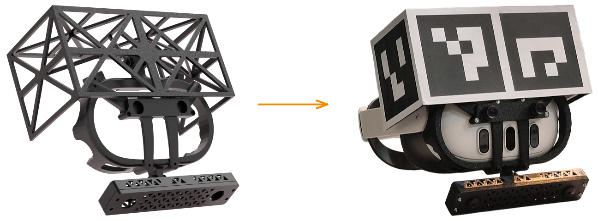

# SELF CAD Files

This repo contains a collection of CAD files that are currently in use in the SELF data collection project. The sensor setup is the following:

  

The hardware used in this project is the following:

- **Quest 3**: The VR headset that is used to collect the data.
- **Raspberry Pi 5**: The main computer that is used to run the data collection software.
- **Power Bank**: An INIU BI-B61 power bank that is used to power the Raspberry Pi 5 (10000 mAh).
- **Stereo Fisheye Camera**: A CaliCam Stereo Fisheye Camera.

All the files can be printed with any common FDM 3D printer in PLA.

The files are organized in the following way:

- **BrainCase**: Contains the case for the Raspberry Pi 5 and the power bank.
- **CalibrationBoard**: Contains the calibration board that is used to track the position of the sensors in the environment. (x1 M4 screw and x1 M4 nut required)
- **CameraCase**: Contains the case for the egocentric stereo camera. (x4 M2, 4x M2.5, 1x M4 screw and 1x M4 nut required)
- **QuestMount**: Contains the brackets that wraps around the Quest 3 and works as a mounting point for the sensors. (x4 M3 screws and x4 M3 nuts required)
- **ExtCameraCase**: Contains the case for the external camera. Still in development.

### Acknowledgements

Some of the files were adapted from the following sources:

- **Raspberry Pi 5 Case**: [link](https://www.printables.com/model/605060-raspberry-pi-5-case-wpower-button-v2)
